<div align="center">

# CAN_Sniffer

### A LoRaWAN-connected OBD‑II / CAN telematics device with GPS tracking, a cloud pipeline, and a live web dashboard

*Diploma project — Technological School of Electronic Systems (TUES) at Technical University of Sofia*
*Profession: Systems Programmer · Specialty: Systems Programming*

</div>

<p align="center">
  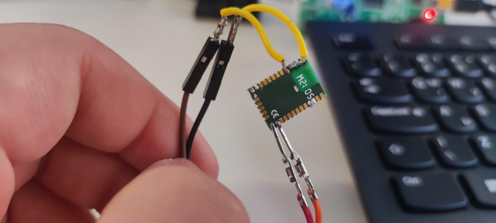
</p>

<p align="center">
  
  
  
  
  
</p>

---

## Overview

**CAN_Sniffer** is a plug‑and‑play device for the OBD‑II diagnostic port of a vehicle. It listens on the car's **CAN bus**, auto‑detects the bus bit rate, decodes standard OBD‑II PIDs, timestamps them with **GPS** coordinates, and pushes everything over **LoRaWAN** to the cloud — where the data is stored and visualized through a purpose‑built **web dashboard**.

It was designed with fleet‑management use cases in mind (freight, courier, logistics), where a large number of vehicles must be monitored cheaply, over long range, and with minimal power draw — conditions that make classic cellular telematics units (Samsara, Fleetio Drive, Geotab GO) expensive to scale.

**Why LoRaWAN instead of GSM/3G/4G?**

| | Cellular (typical fleet trackers) | LoRaWAN (CAN_Sniffer) |
|---|---|---|
| Range | Cell coverage dependent | Long range, works in low‑infrastructure areas |
| Power draw | Higher | Very low — enables sleep‑until‑motion behavior |
| Billing | Fixed monthly data plans | Pay‑per‑byte "data credit" model — cheaper for small, periodic payloads |
| Throughput | High | Low — fine for compact telemetry, not for bulk data |

### Core features

- ✅ Reads live diagnostic data from the vehicle's **OBD‑II port**
- ✅ **Automatic CAN bit‑rate detection** — no manual configuration per vehicle
- ✅ **GPS** positioning via Quectel L96 (with an optional Bluetooth relay to a phone to save LoRaWAN data credits)
- ✅ **LoRaWAN (Helium Network)** uplink of collected telemetry
- ✅ Motion‑triggered wake‑up via onboard accelerometer (keeps the MCU asleep until the car actually moves)
- ✅ End‑to‑end cloud pipeline: **MQTT → Node‑RED → MongoDB**
- ✅ A responsive **web dashboard** (Node.js/Express/EJS) with account management, device pairing, and a live tracker view

---

## Table of Contents

- [System Architecture](#system-architecture)
- [Hardware](#hardware)
- [Printed Circuit Board](#printed-circuit-board)
- [Electrical Schematics](#electrical-schematics)
- [Firmware](#firmware)
- [Cloud Pipeline](#cloud-pipeline)
- [Web Dashboard](#web-dashboard)
- [Repository Structure](#repository-structure)
- [Getting Started](#getting-started)
- [Prototype Evolution](#prototype-evolution)
- [Credits](#credits)

---

## System Architecture

The device sits between the vehicle's diagnostic port and the cloud. Two sensors feed the main MCU: the **OBD‑II/CAN bus** (engine data) and the onboard **GPS** module (location). Collected data is pushed over **LoRaWAN**, ingested through the **Helium Network**, bridged over **MQTT**, processed in **Node‑RED**, and stored in **MongoDB**, where the web UI reads it back out for display.

<p align="center">
  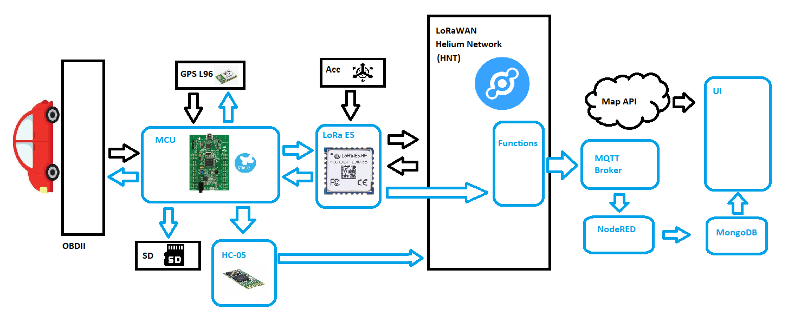
</p>

**Data flow:**

1. **MCU (STM32F407VGT6)** polls the vehicle's OBD‑II port over CAN and reads position/time data from the **GPS module (Quectel L96)**; an **HC‑05 Bluetooth** link is available to relay data via a phone instead of LoRaWAN when a driver is present, saving data credits.
2. Data is handed off to the **LoRa E5 (STM32WLE5JC)** module, which can also independently wake the main MCU when the onboard accelerometer detects vehicle motion, allowing the MCU to stay in a low‑power state otherwise.
3. Telemetry is transmitted over **LoRaWAN** and picked up by the **Helium Network**.
4. Helium forwards messages via **MQTT** to a broker.
5. **Node‑RED** subscribes to the broker, decodes/organizes the payloads, and writes them to **MongoDB**.
6. The **web dashboard** queries MongoDB and a maps API to render the vehicle's live position and vitals.

---

## Hardware

| Component | Part | Role |
|---|---|---|
| Main MCU | **STM32F407VGT6** (Discovery board) | Runs the application, has a built‑in CAN controller |
| Radio / secondary MCU | **Seeed Wio‑E5** (STM32WLE5JC) | LoRaWAN uplink; ultra‑low‑power co‑processor that can run independently of the main MCU |
| CAN transceiver | **MCP2551** | Converts CAN controller logic levels to the differential CAN‑H/CAN‑L bus signaling |
| GPS / GNSS | **Quectel L96‑M33** | Position fixes, PPS, jamming/geofence detection, integrated RTC + LNA |
| Bluetooth | **HC‑05** | Optional phone relay for OBD/GPS data, in place of LoRaWAN |
| Motion sensor | **InvenSense MPU‑6050** | Accelerometer/gyro; wakes the main MCU on hard acceleration/braking events |
| Storage (optional) | microSD + AT24CS08 EEPROM | Local/non‑volatile logging |
| Power | LM1117 LDOs (5V / 3.3V) | Regulated from the OBD‑II port's 11.9–14.5 V supply, with filtering against alternator noise |

<p align="center">
  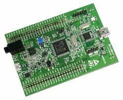
  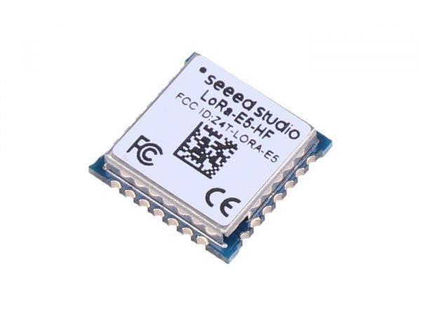
  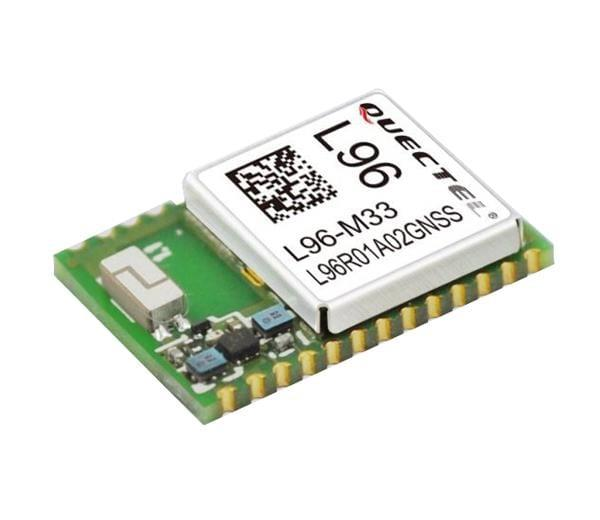
</p>
<p align="center"><sub>STM32F407 Discovery · LoRa‑E5 (Seeed Studio) · Quectel L96 GNSS module</sub></p>

### Electrical requirements

- Powered directly through the vehicle's **OBD‑II port** (11.9 V – 14.5 V), regulated down to the 3.3 V / 5 V rails the components need.
- Supports an external GPS antenna connector for retrofitting into vehicles with obstructed sky view.
- LoRa antenna length is tuned for the 868 MHz band: `λ/4 ≈ 8.64 cm` (`λ = c / f = 300 000 / 868 000 km`).

---

## Printed Circuit Board

The board was iterated through three revisions (see [Prototype Evolution](#prototype-evolution)). Key layout rules followed during design:

- **No sharp 90° trace corners** — sharp bends behave like small antennas and can radiate/couple noise into neighboring traces, especially problematic on high‑speed lines like CAN.
- **Trace width scaled to current/voltage** — wider, thicker copper on the power rails; narrower, tightly‑routed traces for low‑level signal lines to limit EMI.
- **Deliberate component/trace placement** — signal traces routed away from inductors and other noise‑sensitive parts; the power supply section was floor‑planned into its own isolated area of the board.
- **RF keep‑out zones** — no copper pours or traces underneath the GPS/LoRa antenna sections, to avoid detuning them.

<table>
<tr>
<td align="center">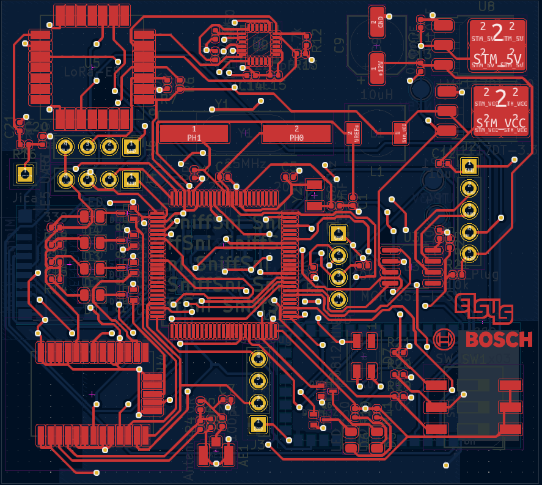<br><sub>Top side (assembly view)</sub></td>
<td align="center">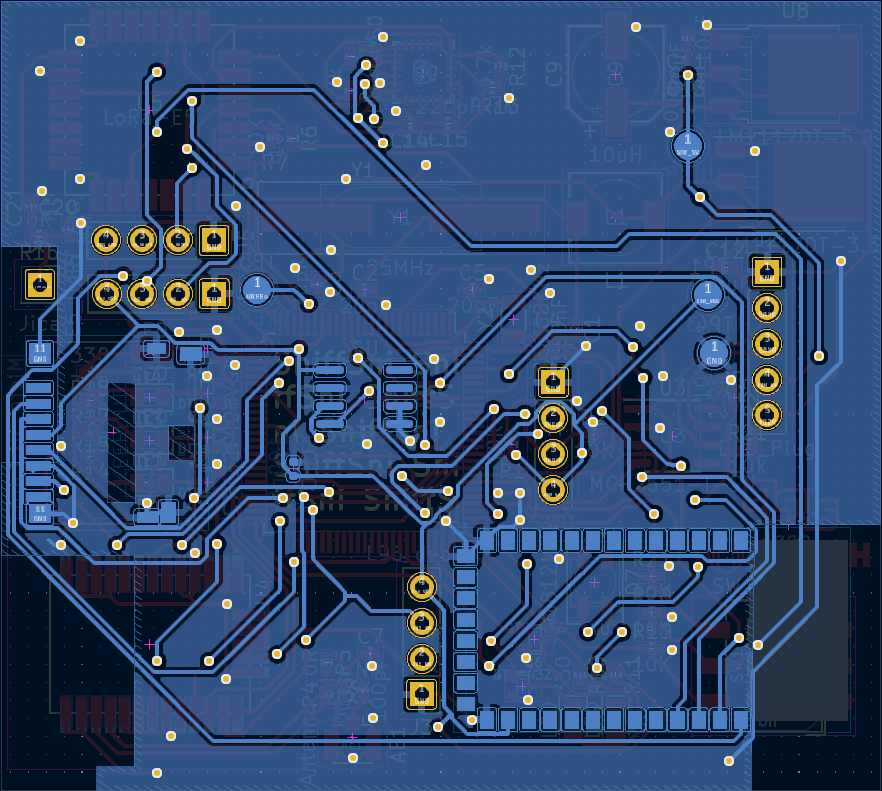<br><sub>Bottom side (assembly view)</sub></td>
</tr>
<tr>
<td align="center">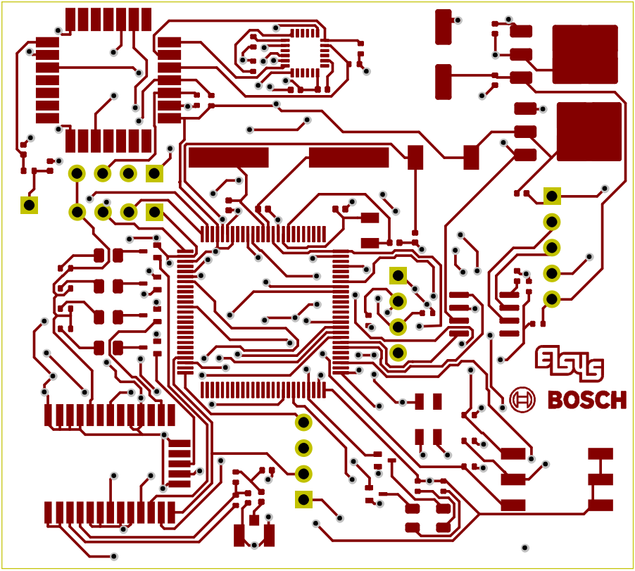<br><sub>Top copper layer</sub></td>
<td align="center">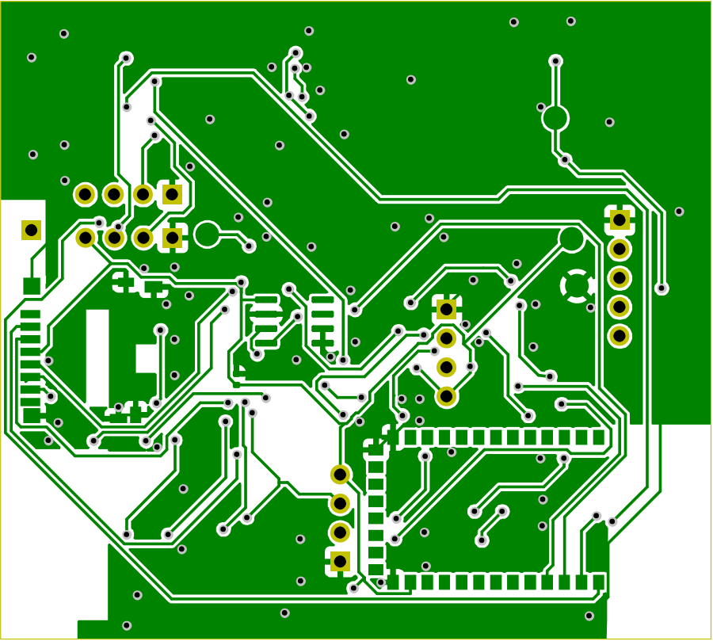<br><sub>Bottom copper layer</sub></td>
</tr>
<tr>
<td align="center">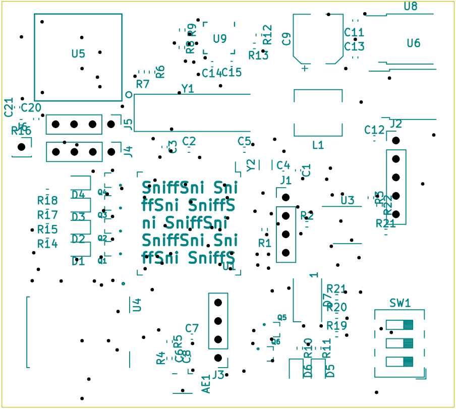<br><sub>Top silkscreen</sub></td>
<td align="center">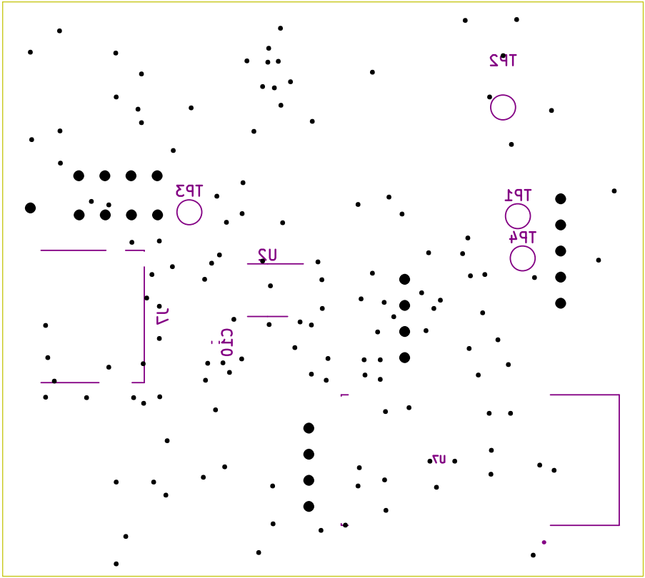<br><sub>Bottom silkscreen</sub></td>
</tr>
</table>

> Designed in **KiCad 7** — see `CAN_Sniffer_HW/*.kicad_sch` / `*.kicad_pcb` (not all board files may be present in every branch; the schematic screenshots below are exported from the design files).

---

## Electrical Schematics

<p align="center">
  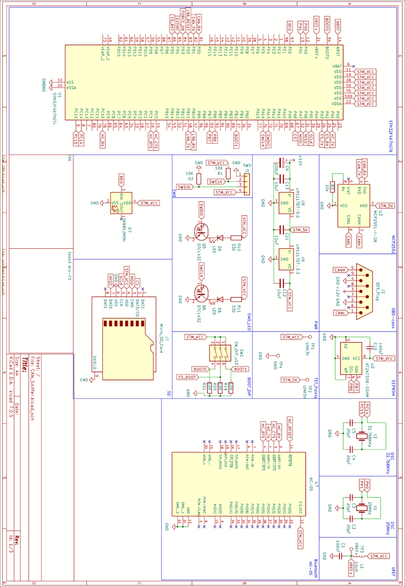
  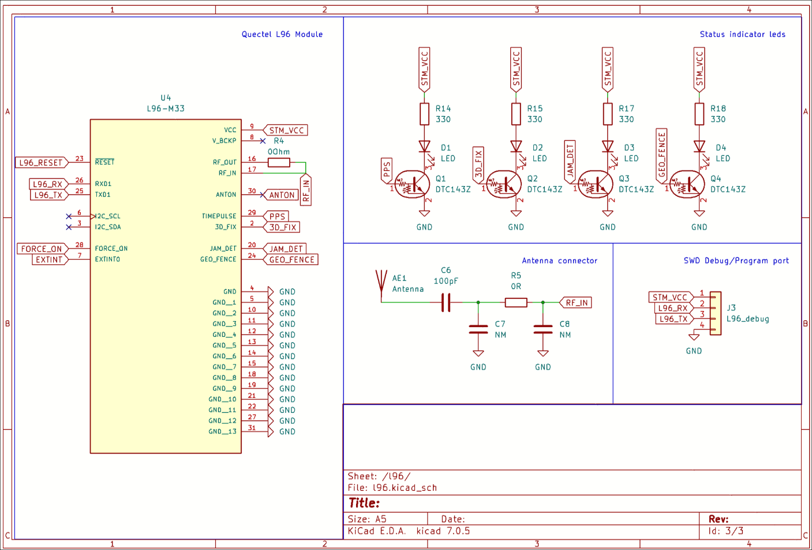
</p>
<p align="center">
  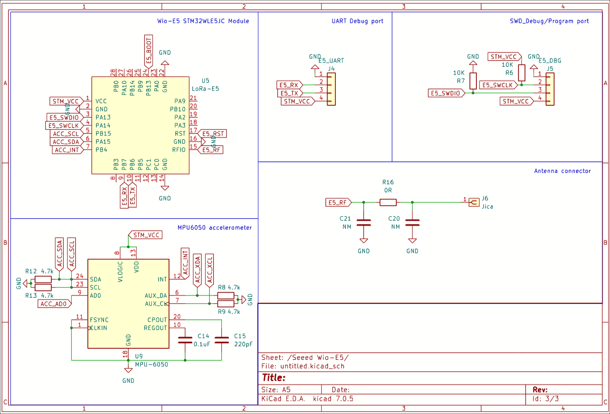
</p>

**Sheet 1 — Main board:** STM32F407VGT6 with its supporting oscillators (25 MHz / 32.768 kHz), the LM1117‑based 5V/3.3V power supply, SWD debug header, boot‑mode DIP switch, status LEDs, the HC‑05 Bluetooth module, the MCP2551 CAN transceiver, and the OBD‑II (DE9) connector.

**Sheet 2 — GPS:** Quectel L96 module, its antenna matching network, status indicator LEDs (PPS / 3D fix / jamming detect / geofence), and a dedicated UART debug header.

**Sheet 3 — LoRa + accelerometer:** The Wio‑E5 (STM32WLE5JC) LoRa module with its own SWD/UART debug headers and 868 MHz antenna matching network, plus the MPU‑6050 accelerometer wired directly to the LoRa module so it can wake the system independently of the main MCU.

---

## Firmware

The STM32 firmware (STM32CubeIDE / HAL) is split by function:

```
CAN_Sniffer_HW/Core/
├── Inc/  OBDII.h   GNSS.h   LoRa.h   main.h
└── Src/  OBDII.c   GNSS.c   LoRa.c   main.c   callbacks.c
```

### CAN / OBD‑II (`OBDII.c`)
- **`CAN1_Init()`** — initializes the CAN peripheral with a caller‑supplied prescaler/mode and no active filters.
- **`Auto_Baudrate_Setup()`** — cycles through candidate prescalers in **silent mode**, listening for valid CAN traffic on each, then locks onto the bit rate that produced a response and switches to normal mode with the real filter applied. This is what lets the device work across different vehicles without manual configuration.
- **`CAN1_Filter_Config()`** — installs an ID/mask filter that only accepts the OBD‑II response frame range (`0x7E8` and related IDs).
- **`Capture_PID()`** — sends a UDS/OBD‑II PID request and blocks (with a retry timeout) until the corresponding response frame arrives.

### GPS (`GNSS.c`)
- **`GNSS_Init()`** — issues a cold‑start command to the Quectel L96, restricts unsolicited output to a `GLL` sentence every 5 fixes, and arms DMA reception on the GPS UART.
- **`GNSS_Transmit()`** — wraps outgoing NMEA/PMTK commands with an automatically computed checksum.
- **`CRC_()`** — XOR checksum used by the NMEA/PMTK protocol.
- **`pharse_GLL()`** — parses an incoming `GLL` sentence into latitude/longitude.
- **`GNSS_Get_Coords()`** — polls for a 3D fix, converts the raw fix data to **WGS‑84** via `xyz_to_wgs84()`, and reports failure until a valid fix (non‑`0.0,0.0`) is obtained.

### LoRaWAN (`LoRa.c`)
- **`LoRa_Init()`** — provisions DevEUI/AppEUI/AppKey and sets OTAA mode (kept for reference; in practice these are provisioned directly on the Wio‑E5's own firmware).
- **`AT_Join()`** — joins the LoRaWAN network over AT commands, retrying until a join confirmation is received.
- **`AT_Send()`** — sends a payload on a given port.
- **`Bypass_DCR()`** — relaxes duty‑cycle restrictions and sets the data rate for testing/development.

The **Wio‑E5** module itself runs a separate, open‑source **FreeRTOS + LoRaWAN stack** firmware (`LoRaWan-E5/`), which handles the radio side independently of the main STM32F407.

Other folders:
- **`CAN_communication_exercise/`** — a standalone STM32CubeIDE test project used while developing CAN/OBD‑II communication.
- **`CAPL/`** — CAPL/CANoe scripts and CAN traces used for bench‑testing against a simulated vehicle bus.

---

## Cloud Pipeline

```
Device → LoRaWAN → Helium Network → MQTT broker → Node‑RED → MongoDB → Web dashboard
```

- **Helium Network** provides the LoRaWAN gateway/network‑server layer and forwards decoded uplinks over **MQTT**.
- **Node‑RED** subscribes to the relevant MQTT topics, unpacks/organizes the payloads (OBD PIDs, GPS fixes) per device, and writes structured documents into MongoDB.
- **MongoDB** stores everything by collection per data type (see below) so the web app can query the latest reading for a given device quickly.

---

## Web Dashboard

The `UI/` folder is a small **Node.js / Express** app using **EJS** templates and a **MongoDB** backend (via `mongoose`/`mongodb` drivers).

**Stack:** `express`, `ejs`, `mongodb` + `mongoose`, `bcrypt` (password hashing), `cookie-parser` (session cookie), `nodemailer` (email 2FA), `validator`, `axios`.

**Pages / flows implemented in `server.js`:**

| Route | Purpose |
|---|---|
| `GET /` | Landing/home page |
| `GET /accountPage` · `POST /login` · `POST /register` | Login & registration, with **email‑based 2FA** (`POST /authorization`) before an account is activated |
| `GET /addDevicePage` · `POST /api_key` | Pair a user account with a device's API key/ID |
| `GET /trackersPage` | The live dashboard: decodes the latest GPS fix (Base64 → hex → WGS‑84 conversion) and the latest OBD‑II PID readings for the paired device |
| `GET /check-for-updates` | Lightweight polling endpoint the frontend can use to know when to refresh |
| `POST /logout` | Clears the session cookie |

**OBD‑II PIDs decoded on the tracker page** (raw CAN‑bus payload → engineering units):

| PID | Signal | Formula |
|---|---|---|
| `0x04` | Engine load | `A × 100 / 255` (%) |
| `0x05` | Coolant temperature | `A − 40` (°C) |
| `0x0B` | Intake manifold pressure | raw byte (kPa) |
| `0x0C` | Engine RPM | `((A×256)+B) / 4` |
| `0x0D` | Vehicle speed | `A` (km/h) |
| `0x0F` | Intake air temperature | `A − 40` (°C) |
| `0x21` | Distance since MIL on | `(A×256)+B` (km) |
| `0x2F` | Fuel level | `A × 100 / 255` (%) |
| `0x42` | Control module voltage | `((A×256)+B) / 1000` (V) |

> ⚠️ **Security note for anyone reusing this repo:** `UI/server.js` currently has the MongoDB connection string and the email account credentials **hardcoded**. Before deploying (or making the repo public with real credentials), move these into environment variables (e.g. a `.env` file loaded with `dotenv`, excluded via `.gitignore`) and rotate any credentials that were ever committed.

---

## Repository Structure

```
CAN_Sniffer/
├── CAN_Sniffer_HW/            # Main STM32F407 firmware (STM32CubeIDE project)
│   └── Core/{Inc,Src}         # OBDII, GNSS, LoRa drivers + main application
├── CAN_communication_exercise/# Standalone CAN/OBD-II bring-up test project
├── CAPL/                      # CANoe/CAPL scripts + CAN bus traces for bench testing
├── LoRaWan-E5/                # Wio-E5 (STM32WLE5JC) FreeRTOS + LoRaWAN stack firmware
├── UI/                        # Node.js/Express/EJS web dashboard + MongoDB models
│   ├── server.js
│   └── views/                 # EJS templates, stylesheets, static assets
└── docs/                      # Datasheets (LoRa-E5 AT command spec, Quectel GNSS spec, BNO085/L96 notes)
```

---

## Getting Started

### 1. Flash the main board firmware
1. Open `CAN_Sniffer_HW/CAN_Sniffer_HW.ioc` in **STM32CubeIDE**.
2. Build and flash to the STM32F407VGT6 over SWD.
3. Connect the board to a vehicle's OBD‑II port (or a CAN bus simulator/CANoe setup using the traces in `CAPL/`).

### 2. Provision the LoRa‑E5 module
1. Flash/configure the Wio‑E5 with the FreeRTOS LoRaWAN firmware in `LoRaWan-E5/` (or use its stock AT‑command firmware).
2. Set `DevEUI` / `AppEUI` / `AppKey` for your LoRaWAN network (e.g. Helium).

### 3. Run the web dashboard
```bash
cd UI
npm install
# Set MONGODB_URI, SMTP credentials, etc. as environment variables
# (see the Security note above — don't reuse the hardcoded ones from server.js)
node server.js
```
The app listens on `http://127.0.0.1:3000` by default (`PORT` env var to override).

### 4. Wire up the cloud pipeline
- Connect your LoRaWAN network server (e.g. Helium) to forward uplinks via **MQTT**.
- Import/build a **Node‑RED** flow that subscribes to the MQTT topics and writes parsed documents into the MongoDB collections the dashboard reads from (`OBD`, `GPS`, and one collection per PID, e.g. `0x0C`, `0x0D`, …).

---

## Prototype Evolution

| | |
|---|---|
| <br><sub>**Bring-up rig** — Wio‑E5 DevKit + STM32F407 Discovery + Quectel L96 + MCP2551, wired together to validate the firmware before committing to a custom PCB.</sub> | 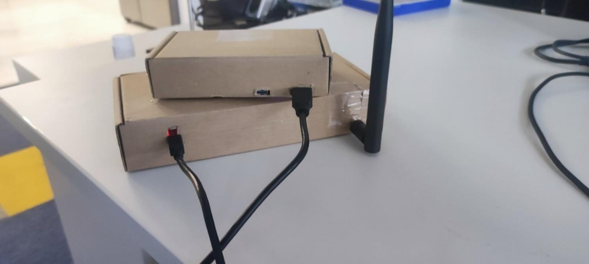<br><sub>Close-up of the Bluetooth/HC‑05 bring‑up wiring.</sub> |
| 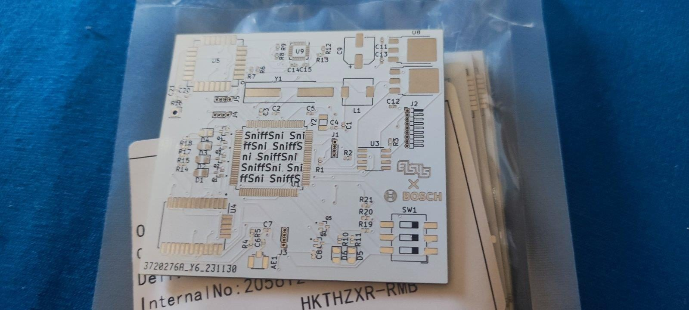<br><sub>**Rev. 1 PCB** — first custom board. Functional, but with layout issues: oversized pin headers, some incorrectly routed traces.</sub> | 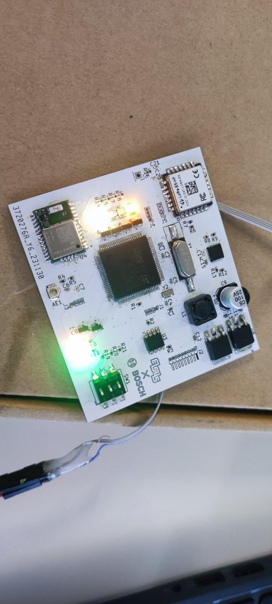<br><sub>Rev. 1, assembled and powered up.</sub> |
| 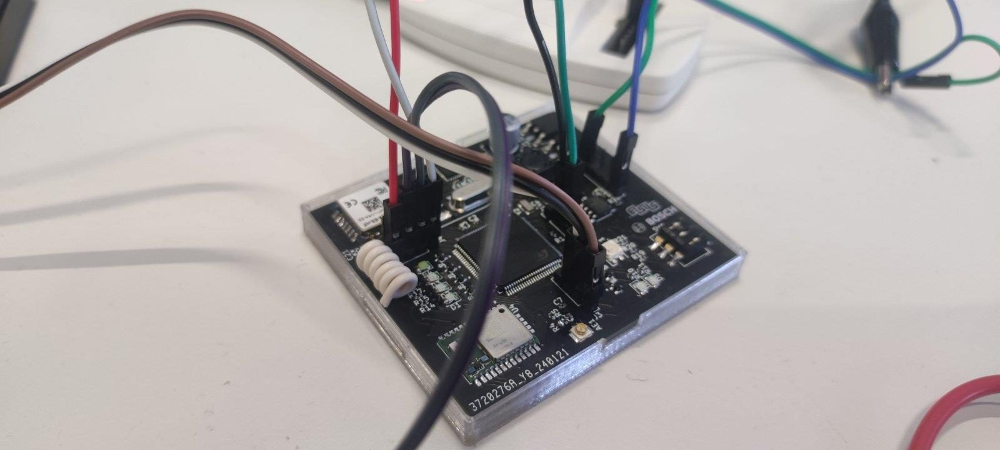<br><sub>**Rev. 2 PCB** — corrected header footprints and routing.</sub> | |

---

## Credits

| | |
|---|---|
| **Author** | Ivan Viktorov Ivanov |
| **Supervisor** | Eng. Valeri Polyakov |
| **Institution** | Technological School of Electronic Systems (TUES), Technical University of Sofia |
| **Program** | Systems Programmer (481020) / Systems Programming (4810201) |
| **Year** | 2024 |

